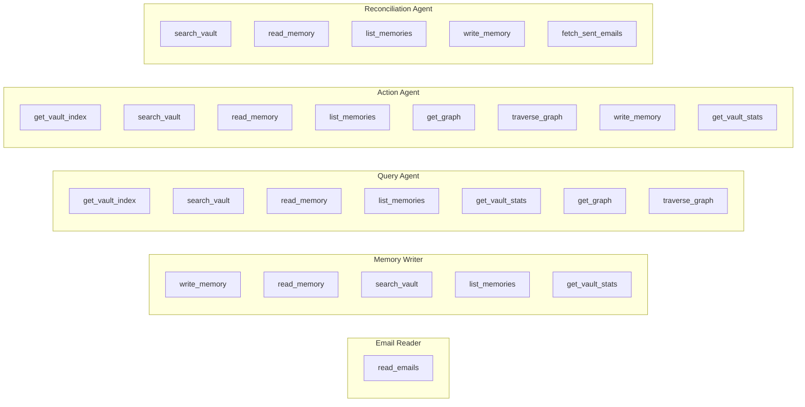
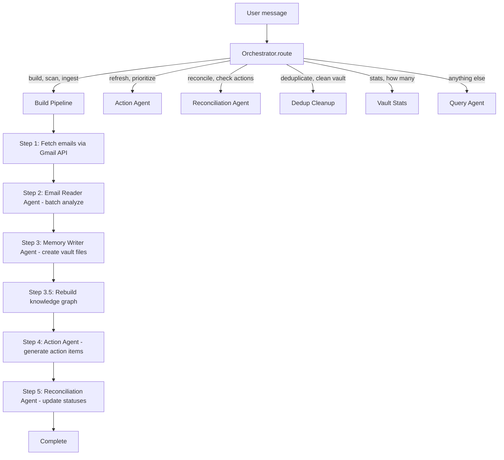
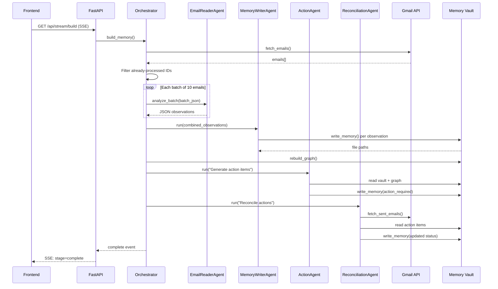
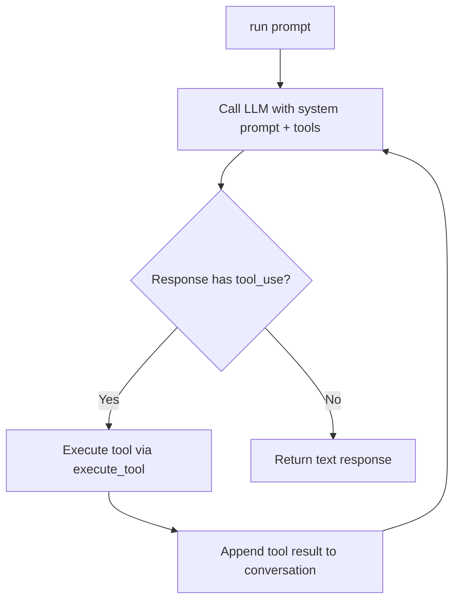
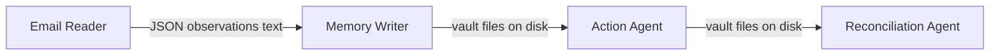

# Agentic Architecture

## Agent Inventory

| Agent | File | Role | Trigger |
|-------|------|------|---------|
| Email Reader | `agents/email_reader.py` | Fetches emails from Gmail and produces structured JSON observations about the user (including `commitment_status` for commitments) | Build pipeline step 2 |
| Memory Writer | `agents/memory_writer.py` | Converts observations into structured vault files (YAML frontmatter + markdown). Sets `commitment_status` for commitment files. | Build pipeline step 3 |
| Query Agent | `agents/query_agent.py` | Searches the vault and answers user questions conversationally | Any non-keyword chat message |
| Action Agent | `agents/action_agent.py` | Scans vault + knowledge graph, creates Eisenhower-prioritized action items | Build pipeline step 4, or "refresh" keyword |
| Reconciliation Agent | `agents/reconciliation_agent.py` | Compares action items against sent emails, updates status (active/closed/expired) | Build pipeline step 5, or "reconcile" keyword |

## Agent Tools

## Tool Permission Matrix

Each agent receives only the tools it needs — **no agent has universal access**. This matrix shows exactly which tools each agent can call:

| Tool | EmailReader | MemoryWriter | QueryAgent | ActionAgent | ReconciliationAgent |
| ---- | :-: | :-: | :-: | :-: | :-: |
| `read_emails` | **R** | | | | |
| `fetch_sent_emails` | | | | | **R** |
| `write_memory` | | **W** | | **W** | **W** |
| `read_memory` | | **R** | **R** | **R** | **R** |
| `search_vault` | | **R** | **R** | **R** | **R** |
| `list_memories` | | **R** | **R** | **R** | **R** |
| `get_vault_index` | | | **R** | **R** | |
| `get_vault_stats` | | **R** | **R** | | |
| `get_graph` | | | **R** | **R** | |
| `traverse_graph` | | | **R** | **R** | |

**R** = read-only, **W** = write

Key observations:

- **QueryAgent is strictly read-only** — it cannot modify the vault
- **EmailReader only talks to Gmail** — no vault tools at all
- **ReconciliationAgent is the only agent with `fetch_sent_emails`** — sent mail access is tightly scoped
- Vault read tools (`search_vault`, `read_memory`, `list_memories`) are the closest to "universal" — 4 of 5 agents have them

## Orchestration Flow

## Build Pipeline Sequence

## Base Agent (Agentic Loop)

All agents inherit from `BaseAgent` (`agents/base_agent.py`), which provides:

- **LLM provider adapter**: OpenRouter (primary, OpenAI SDK format) with automatic Anthropic fallback
- **Retry logic**: 8 retries with exponential backoff (base 2s) on 429/529 errors
- **Tool-call handling**: Loops until the LLM returns a text response (no more tool calls)
- **Format conversion**: Automatically converts between OpenAI and Anthropic message/tool formats

## Agent Data Flow

Agents share **no state**. Data flows as text between pipeline stages:

- Email Reader output is a raw JSON string passed as a prompt to Memory Writer
- Memory Writer writes files to disk; Action Agent reads them via vault tools
- Reconciliation Agent reads action items from vault and sent emails from Gmail

## MCP Server Mapping

| MCP Server | File | Exposed Tools | Used By |
|------------|------|---------------|---------|
| Gmail MCP | `mcp_servers/gmail_server.py` | `read_emails`, `fetch_sent_emails` | Email Reader, Reconciliation Agent |
| Memory MCP | `mcp_servers/memory_server.py` | `write_memory`, `read_memory`, `search_vault`, `list_memories`, `get_vault_index`, `get_vault_stats`, `get_graph`, `traverse_graph` | Memory Writer, Query Agent, Action Agent, Reconciliation Agent |

## Key Design Decisions

- **No shared state**: Agents communicate via text output, not shared memory. This makes them independently testable and replaceable.
- **Keyword routing**: The orchestrator uses simple string matching (not LLM-based intent classification) for routing. Fast and deterministic.
- **Batch analysis**: Emails are split into batches of 10 for the Email Reader. Each batch gets a fresh agent context to stay within token limits.
- **Incremental processing**: Processed email IDs are tracked in `_processed_emails.json`. Subsequent builds skip already-processed emails.
- **Programmatic dedup**: `memory/dedup.py` runs inside `write_memory()` as a pre-write safety net, catching duplicates the LLM misses.
