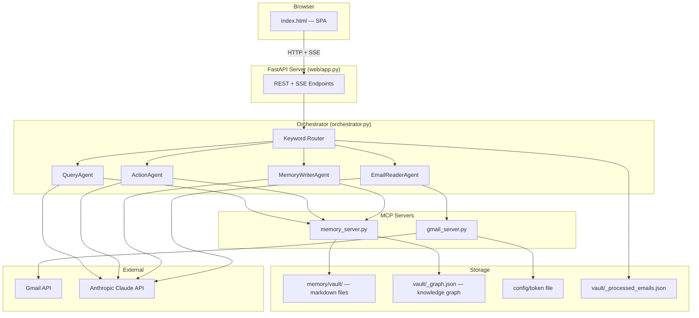

# Architecture Overview

## System Map

## Components

| Component | File | Role |
|-----------|------|------|
| Entry point | `main.py` | Starts uvicorn on port 8000 |
| Web server | `web/app.py` | FastAPI — REST, SSE, static files |
| Frontend | `web/static/index.html` | Single-page app (vanilla JS) |
| Orchestrator | `orchestrator.py` | Routes requests, manages pipeline |
| Email Reader | `agents/email_reader.py` | Fetches + analyzes emails via Claude |
| Memory Writer | `agents/memory_writer.py` | Creates structured vault files via Claude |
| Query Agent | `agents/query_agent.py` | Searches vault + answers questions via Claude |
| Action Agent | `agents/action_agent.py` | Scans vault + graph, creates Eisenhower-prioritized action items |
| Base Agent | `agents/base_agent.py` | Agentic loop, tool-call handling |
| Gmail MCP | `mcp_servers/gmail_server.py` | Exposes Gmail API as MCP tools |
| Memory MCP | `mcp_servers/memory_server.py` | Exposes vault read/write as MCP tools |
| Vault helpers | `memory/vault.py` | Init, search, stats, read/write, processed ID tracking |
| Knowledge graph | `memory/graph.py` | Bidirectional graph: rebuild, traverse, backlink injection |
| Gmail tools | `tools/gmail_tools.py` | OAuth, email fetching, auth checks |
| Config | `config/settings.py` | Central settings (paths, model, limits) |

## Key Design Decisions

- **No shared state between agents** — data flows as text (email_reader output -> memory_writer input)
- **MCP protocol** — agents consume tools from MCP servers, not direct function calls
- **File-based vault** — YAML frontmatter + markdown body + wiki-links
- **Knowledge graph** — `_graph.json` is a bidirectional adjacency map rebuilt on every `write_memory()`. Backlinks auto-injected into frontmatter.
- **Keyword routing** — simple string matching in orchestrator (not LLM-based)
- **Incremental processing** — tracks processed email IDs in `_processed_emails.json`
