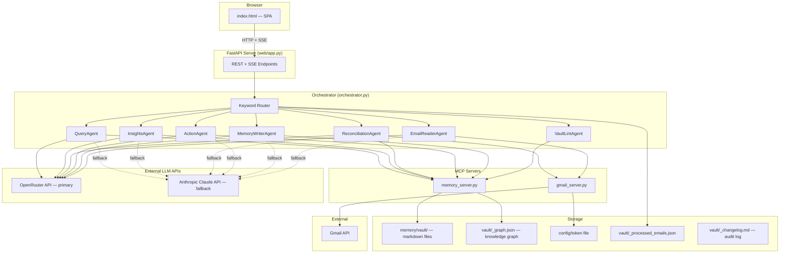

# Architecture Overview

## System Map

```mermaid
graph TB
    subgraph Browser
        UI[index.html — SPA]
    end

    subgraph "FastAPI Server (web/app.py)"
        API[REST + SSE Endpoints]
    end

    subgraph "Orchestrator (orchestrator.py)"
        Router[Keyword Router]
        ER[EmailReaderAgent]
        MW[MemoryWriterAgent]
        AA[ActionAgent]
        RA[ReconciliationAgent]
        IA[InsightsAgent]
        QA[QueryAgent]
        VLA[VaultLintAgent]
    end

    subgraph "MCP Servers"
        GS[gmail_server.py]
        MS[memory_server.py]
    end

    subgraph "External LLM APIs"
        OR[OpenRouter API — primary]
        Claude[Anthropic Claude API — fallback]
    end

    subgraph External
        Gmail[Gmail API]
    end

    subgraph Storage
        Vault[memory/vault/ — markdown files]
        Graph[vault/_graph.json — knowledge graph]
        Token[config/token file]
        Processed[vault/_processed_emails.json]
        Changelog[vault/_changelog.md — audit log]
    end

    UI -->|HTTP + SSE| API
    API --> Router
    Router --> ER
    Router --> MW
    Router --> AA
    Router --> RA
    Router --> IA
    Router --> QA
    Router --> VLA
    VLA --> MS
    ER --> GS
    ER --> OR
    ER -.->|fallback| Claude
    MW --> MS
    MW --> OR
    MW -.->|fallback| Claude
    AA --> MS
    AA --> OR
    AA -.->|fallback| Claude
    RA --> MS
    RA --> GS
    RA --> OR
    RA -.->|fallback| Claude
    IA --> MS
    IA --> OR
    IA -.->|fallback| Claude
    QA --> MS
    QA --> OR
    QA -.->|fallback| Claude
    GS --> Gmail
    MS --> Vault
    MS --> Graph
    GS --> Token
    Router --> Processed
```

## Components

| Component | File | Role |
|-----------|------|------|
| Entry point | `main.py` | Starts uvicorn on port 8000 |
| Web server | `web/app.py` | FastAPI — REST, SSE, static files |
| Frontend | `web/static/index.html` | Single-page app (vanilla JS) |
| Orchestrator | `orchestrator.py` | Routes requests, manages pipeline |
| Email Reader | `agents/email_reader.py` | Fetches + analyzes emails via Claude |
| Memory Writer | `agents/memory_writer.py` | Creates structured vault files via Claude |
| Query Agent | `agents/query_agent.py` | Searches vault + answers questions via Claude |
| Action Agent | `agents/action_agent.py` | Scans vault + graph, creates Eisenhower-prioritized action items |
| Reconciliation Agent | `agents/reconciliation_agent.py` | Compares action items vs sent emails, updates status (active/closed/expired) |
| Insights Agent | `agents/insights_agent.py` | Cross-correlates vault to discover relationships, execution gaps, strategic patterns |
| Base Agent | `agents/base_agent.py` | Agentic loop, tool-call handling, LLM provider adapter |
| Gmail MCP | `mcp_servers/gmail_server.py` | Exposes Gmail API as MCP tools |
| Memory MCP | `mcp_servers/memory_server.py` | Exposes vault read/write as MCP tools |
| Vault helpers | `memory/vault.py` | Init, search, stats, read/write, processed ID tracking |
| Dedup module | `memory/dedup.py` | Programmatic duplicate detection + merging + cleanup |
| Knowledge graph | `memory/graph.py` | Bidirectional graph: rebuild, traverse, backlink injection |
| Knowledge Index | `memory/knowledge_index.py` | Builds compact entity catalog for agent prompt injection |
| Changelog | `memory/changelog.py` | Append-only audit log of vault mutations |
| Email filter | `tools/email_filter.py` | Heuristic noise classifier (skips newsletters, receipts, notifications) |
| Gmail tools | `tools/gmail_tools.py` | OAuth, email fetching, auth checks |
| Vault Lint | `memory/vault_lint.py` | Pure-function lint checks (stale action items, orphaned files, empty content) |
| Vault Lint Agent | `agents/vault_lint_agent.py` | Formats vault lint results into human-readable health report |
| Change Detection | `memory/change_detection.py` | SHA-256 hash-based file change tracking |
| Scheduler | `memory/scheduler.py` | Lightweight task scheduler with JSON config and state persistence |
| Git history | `memory/git_history.py` | subprocess-based git wrapper for vault version history (init, commit, log) |
| Config | `config/settings.py` | Central settings (paths, model, limits) |

## Key Design Decisions

- **No shared state between agents** — data flows as text (email_reader output -> memory_writer input)
- **MCP protocol** — agents consume tools from MCP servers, not direct function calls
- **File-based vault** — YAML frontmatter + markdown body + wiki-links
- **Knowledge graph** — `_graph.json` is a bidirectional adjacency map rebuilt on every `write_memory()`. Backlinks auto-injected into frontmatter.
- **Programmatic dedup** — `memory/dedup.py` runs inside `write_memory()` as a pre-write safety net. People matched by `name` frontmatter; non-people matched by normalized title containment, word-set overlap, or fuzzy matching (SequenceMatcher >= 0.70). One-time cleanup via `deduplicate` keyword.
- **Keyword routing** — simple string matching in orchestrator (not LLM-based)
- **Multi-provider LLM** — OpenRouter (default, Kimi K2.5) with automatic Anthropic fallback. Adapter in `base_agent.py` converts between OpenAI and Anthropic message formats.
- **Incremental processing** — tracks processed email IDs in `_processed_emails.json`
- **Audit trail** — `_changelog.md` is an append-only log of all vault mutations (created/updated/merged). Logic in `memory/changelog.py`.
- **Knowledge Index** — `memory/knowledge_index.py` scans all vault files and builds a compact markdown table of entities (name, filepath, key fields). Injected into MemoryWriter prompt before each run so the LLM can resolve against existing entities, reducing duplicates.
- **Email noise filter** — `tools/email_filter.py` classifies emails as signal/noise using Gmail labels, sender patterns, subject keywords, and body markers. Runs between email fetch and batch analysis, saving tokens and reducing vault clutter.
- **Organizations and projects as entity types** — `organizations` and `projects` are first-class vault memory types alongside `people`, `decisions`, and `commitments`. Each has type-specific frontmatter: organizations carry `domain`, `industry`, and `relationship_type`; projects carry `project_status` and `project_type`. Both appear in the Knowledge Index for entity resolution.
- **Vault linting** — `memory/vault_lint.py` provides pure-function lint checks for vault health (stale action items, orphaned files, empty content). `agents/vault_lint_agent.py` formats results into a human-readable report. Triggered via `lint`/`health check`/`vault health` keywords.
- **Change detection** — `memory/change_detection.py` tracks SHA-256 hashes of vault files in `_file_state.json`, enabling efficient detection of which files changed between runs.
- **Background scheduling** — `memory/scheduler.py` is a lightweight task scheduler driven by a JSON config file (`config/scheduled_tasks.example.json`). State is persisted between runs. The `--run-scheduled` CLI flag in `main.py` executes any due tasks without starting the web server.
- **Git version history** — the vault directory is its own standalone git repo. `memory/git_history.py` wraps subprocess git calls (init, add, commit, log) with no GitPython dependency. The orchestrator auto-commits after each pipeline stage (memory write, graph rebuild, actions, reconciliation, insights), giving every vault state a recoverable snapshot.
- **Universal status fields** — every memory type (people, decisions, commitments, action_required) now carries `status`, `status_reason`, and `status_updated` fields. Email Reader emits `status_hint` signals on state-change evidence (e.g., person left org, decision reversed); Memory Writer propagates them into frontmatter.
- **Universal confidence** — every memory type carries a `confidence` field (`high`/`medium`/`low`) reflecting the strength of evidence. Email Reader scores confidence based on corroboration, recency, and evidence type; Memory Writer passes it through. Insights already had this field; all other types now share it.
- **Context-optimized queries** — `QueryAgent.ask_with_index(question)` injects the Knowledge Index into the prompt before searching the vault, giving the LLM a metadata-level overview of all entities. The orchestrator's `query_memory()` calls `ask_with_index` so every chat query benefits from this pre-filtering before the agent reads full files.
