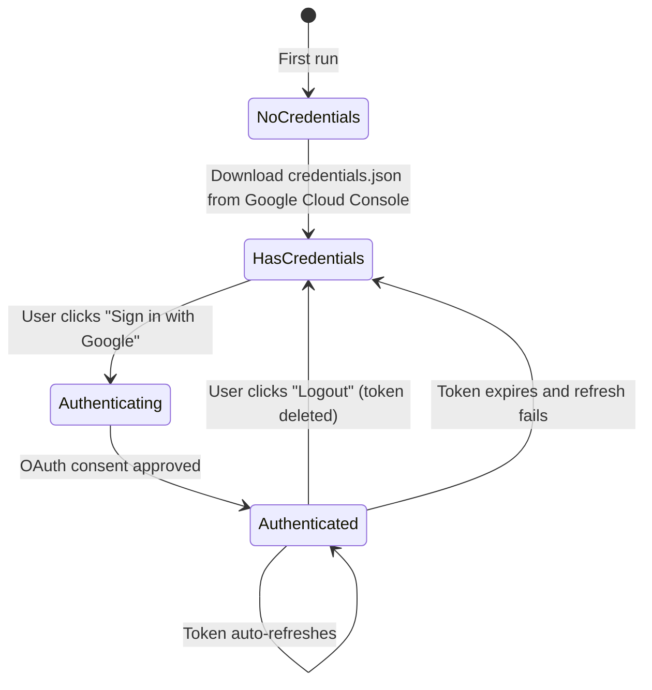

# Auth Flow

## Overview

Gmail OAuth2 with read-only scope. Single-user local system (no multi-tenant).

## Authentication Methods

| Method | Provider | Scope | Token Storage |
|--------|----------|-------|---------------|
| OAuth2 (Installed App) | Google | `gmail.readonly` | `config/token` file (local) |

## Token Lifecycle

## Endpoints

| Endpoint | Action |
|----------|--------|
| `GET /api/auth/status` | Returns `{authenticated, credentials_exist}` |
| `POST /api/auth/google` | Triggers `InstalledAppFlow.run_local_server()` |
| `POST /api/auth/logout` | Deletes token file via `TOKEN_PATH.unlink()` |
| `GET /api/auth/user-info` | Returns `{email, authenticated}` from Gmail profile |

## Frontend Auth Gate

1. `init()` calls `checkLoginStatus()` on page load
2. Fetches `/api/auth/status`
3. If `authenticated: true` -> hides login overlay, shows main app, starts auto-build
4. If `authenticated: false` -> shows full-screen login page with Google sign-in button
5. After login, `loadUserInfo()` populates sidebar footer and logout header with email
6. Logout deletes token server-side and re-shows login page

## Security Notes

- OAuth credentials (`credentials.json`) must never be committed to git
- Token file must never be committed to git
- `gmail.readonly` scope ensures the app can never modify, delete, or send emails
- Token refresh is handled by Google's auth library automatically
