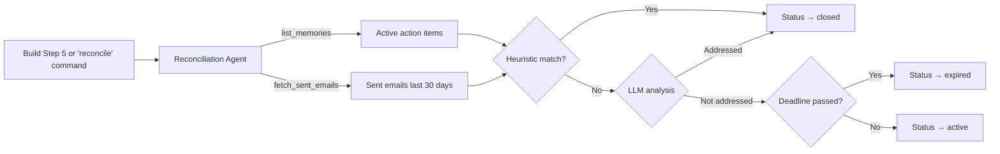
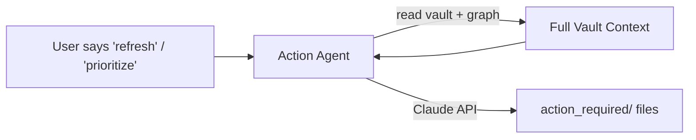
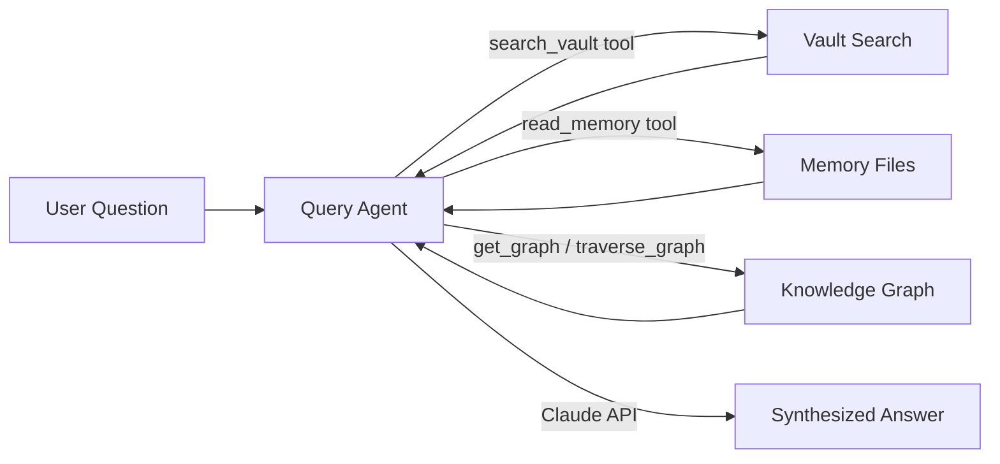
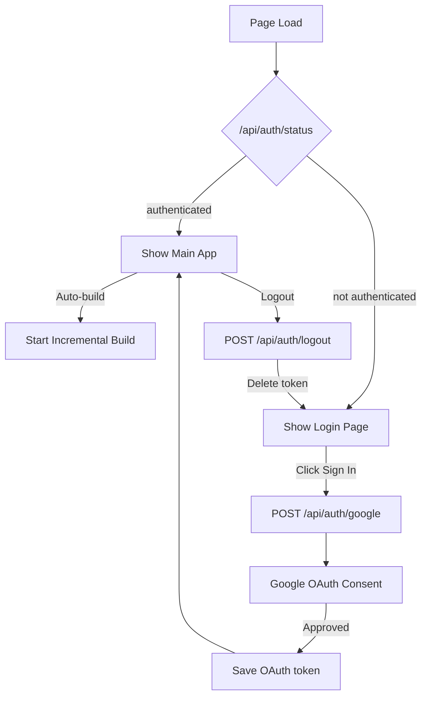

# Data Flow

## Build Pipeline (Email to Memory)

```mermaid
flowchart LR
    subgraph "Step 1: Fetch"
        Gmail[Gmail API] -->|messages.list + get| Emails[Raw Emails JSON]
    end

    subgraph "Step 2: Filter"
        Emails --> Dedup{Already processed?}
        Dedup -->|Yes| Skip[Skip]
        Dedup -->|No| New[New Emails]
    end

    subgraph "Step 3: Batch Analyze"
        New -->|Batches of 10| ER[Email Reader Agent]
        ER -->|Claude API| Observations[Text Observations]
    end

    subgraph "Step 4: Write"
        Observations --> MW[Memory Writer Agent]
        MW -->|Claude API + MCP tools| Vault[Vault Files]
    end

    subgraph "Step 5: Track"
        Vault --> IDs[Save processed IDs]
    end

    subgraph "Step 6: Graph"
        IDs --> GR[Rebuild _graph.json]
    end

    subgraph "Step 7: Actions"
        GR --> AA[Action Agent]
        AA -->|Claude API + vault + graph| Actions[action_required/ files]
    end

    subgraph "Step 8: Reconcile"
        Actions --> RA[Reconciliation Agent]
        RA -->|heuristic + LLM + sent emails| StatusUpdates[Update status fields]
    end
```

### Batch processing detail

1. Orchestrator fetches up to 500 emails from last 180 days
2. Loads `_processed_emails.json`, filters out already-seen IDs
3. Splits remaining into batches of `EMAIL_BATCH_SIZE` (10)
4. Each batch sent to `EmailReaderAgent.analyze_batch()` which returns text observations
5. All observations concatenated and sent to `MemoryWriterAgent.run()` to create vault files
6. Newly processed IDs saved to `_processed_emails.json`

### Progress events (SSE)

Each pipeline stage emits progress events via callback to queue to SSE:
- `fetching` → `email_reader` (per batch) → `memory_writer` → `graph_rebuild` → `action_agent` → `reconciliation` → `complete`

## Reconciliation Pipeline

Hybrid matching: heuristic subject/recipient overlap first (fast, free), then LLM for ambiguous items (accurate, costs API). Deadline expiry checked independently.

## Refresh Pipeline (Action Agent — Standalone)

Triggered via `GET /api/stream/refresh` (SSE) or chat keywords. The Action Agent reads the full vault and `_graph.json`, then creates/updates Eisenhower-classified action items.

## Query Pipeline

## Auth Flow

