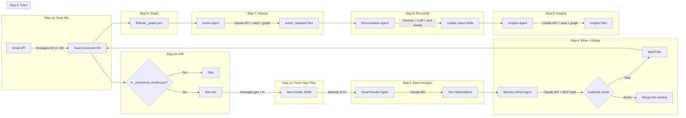
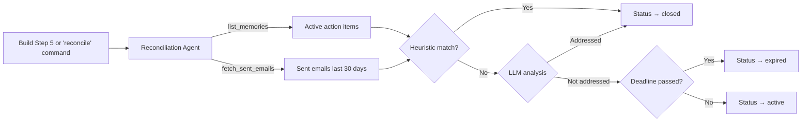
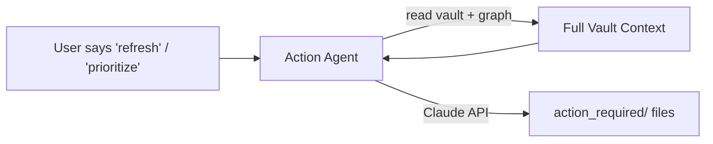
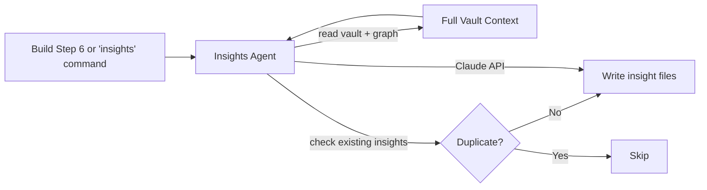
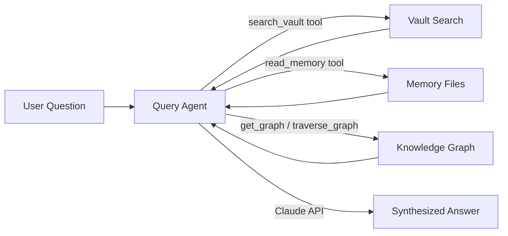
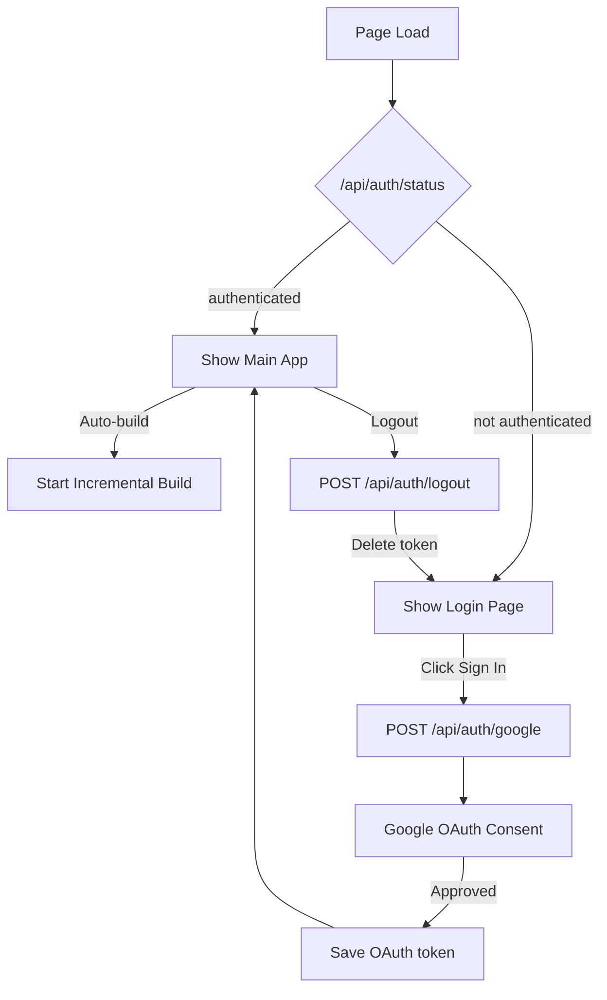

# Data Flow

## Build Pipeline (Email to Memory)

```mermaid
flowchart LR
    subgraph "Step 1a: Scan IDs"
        Gmail[Gmail API] -->|"messages.list (1 call)"| IDs[Message IDs]
    end

    subgraph "Step 1b: Diff"
        IDs --> Diff{"In _processed_emails.json?"}
        Diff -->|Yes| Skip[Skip]
        Diff -->|No| NewIDs[New IDs]
    end

    subgraph "Step 1c: Fetch New Only"
        NewIDs -->|"messages.get × N"| New[New Emails JSON]
    end

    subgraph "Step 2: Batch Analyze"
        New -->|Batches of 10| ER[Email Reader Agent]
        ER -->|Claude API| Observations[Text Observations]
    end

    subgraph "Step 4: Write + Dedup"
        Observations --> MW[Memory Writer Agent]
        MW -->|Claude API + MCP tools| Dedup{Duplicate check}
        Dedup -->|New| Vault[Vault Files]
        Dedup -->|Exists| Merge[Merge into existing]
    end

    subgraph "Step 5: Track"
        Vault --> IDs[Save processed IDs]
    end

    subgraph "Step 6: Graph"
        IDs --> GR[Rebuild _graph.json]
    end

    subgraph "Step 7: Actions"
        GR --> AA[Action Agent]
        AA -->|Claude API + vault + graph| Actions[action_required/ files]
    end

    subgraph "Step 8: Reconcile"
        Actions --> RA[Reconciliation Agent]
        RA -->|heuristic + LLM + sent emails| StatusUpdates[Update status fields]
    end

    subgraph "Step 9: Insights"
        StatusUpdates --> IA[Insights Agent]
        IA -->|Claude API + vault + graph| Insights["insights/ files"]
    end
```

### Incremental ingestion detail

1. **Scan IDs (cheap):** `list_email_ids()` calls `messages.list` once to get up to 500 message IDs from last 180 days — no email content is fetched
2. **Diff:** Loaded IDs are compared against `_processed_emails.json` to identify only new (unprocessed) emails
3. **Fetch new only:** `fetch_emails_by_ids()` calls `messages.get` only for the new IDs — the primary cost savings (e.g., 17 API calls instead of 501 on incremental rebuild)
4. Splits new emails into batches of `EMAIL_BATCH_SIZE` (10)
5. Each batch sent to `EmailReaderAgent.analyze_batch()` which returns text observations
6. All observations concatenated and sent to `MemoryWriterAgent.run()` to create vault files. Each `write_memory()` call checks for duplicates via `memory/dedup.py` — if a matching file exists, content is merged instead of creating a new file.
7. Newly processed IDs saved to `_processed_emails.json`

### Progress events (SSE)

Each pipeline stage emits progress events via callback to queue to SSE:
- `fetching` → `email_reader` (per batch) → `memory_writer` → `graph_rebuild` → `action_agent` → `reconciliation` → `insights` → `complete`

## Reconciliation Pipeline

```mermaid
flowchart LR
    Trigger["Build Step 5 or 'reconcile' command"] --> RA[Reconciliation Agent]
    RA -->|list_memories| Active[Active action items]
    RA -->|fetch_sent_emails| Sent[Sent emails last 30 days]
    Active --> Match{Heuristic match?}
    Sent --> Match
    Match -->|Yes| Closed[Status → closed]
    Match -->|No| LLM{LLM analysis}
    LLM -->|Addressed| Closed
    LLM -->|Not addressed| Expiry{Deadline passed?}
    Expiry -->|Yes| Expired[Status → expired]
    Expiry -->|No| Stays[Status → active]
```

Hybrid matching: heuristic subject/recipient overlap first (fast, free), then LLM for ambiguous items (accurate, costs API). Deadline expiry checked independently.

## Refresh Pipeline (Action Agent — Standalone)

```mermaid
flowchart LR
    Trigger["User says 'refresh' / 'prioritize'"] --> AA[Action Agent]
    AA -->|read vault + graph| Context[Full Vault Context]
    Context --> AA
    AA -->|Claude API| Actions[action_required/ files]
```

Triggered via `GET /api/stream/refresh` (SSE) or chat keywords. The Action Agent reads the full vault and `_graph.json`, then creates/updates Eisenhower-classified action items.

## Insights Pipeline

```mermaid
flowchart LR
    Trigger["Build Step 6 or 'insights' command"] --> IA[Insights Agent]
    IA -->|read vault + graph| Context[Full Vault Context]
    Context --> IA
    IA -->|check existing insights| Dedup{Duplicate?}
    Dedup -->|No| Write[Write insight files]
    Dedup -->|Yes| Skip[Skip]
    IA -->|Claude API| Write
```

Triggered via `GET /api/stream/insights` (SSE) or chat keywords (`insights`, `patterns`, `connections`). The Insights Agent reads the full vault and graph, cross-correlates across 2+ source memories, and creates up to 3 insight files per run.

## Query Pipeline

```mermaid
flowchart LR
    User[User Question] --> QA[Query Agent]
    QA -->|search_vault tool| Search[Vault Search]
    QA -->|read_memory tool| Read[Memory Files]
    QA -->|get_graph / traverse_graph| Graph[Knowledge Graph]
    Search --> QA
    Read --> QA
    Graph --> QA
    QA -->|Claude API| Answer[Synthesized Answer]
```

## Auth Flow

```mermaid
flowchart TD
    Load[Page Load] --> Check{/api/auth/status}
    Check -->|authenticated| Main[Show Main App]
    Check -->|not authenticated| Login[Show Login Page]
    Login -->|Click Sign In| OAuth[POST /api/auth/google]
    OAuth --> Google[Google OAuth Consent]
    Google -->|Approved| Token[Save OAuth token]
    Token --> Main
    Main -->|Auto-build| Build[Start Incremental Build]
    Main -->|Logout| Del[POST /api/auth/logout]
    Del -->|Delete token| Login
```
