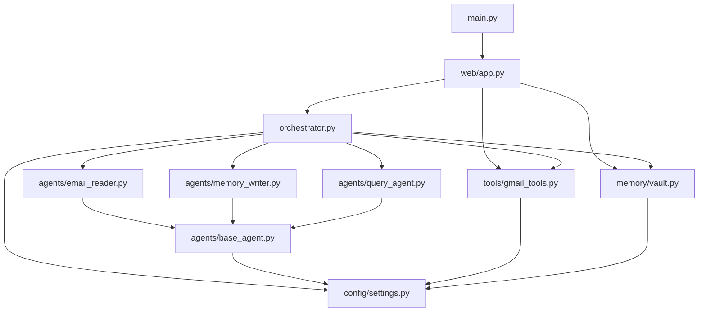

# Dependency Graph

## Internal Module Dependencies

## Blast Radius Analysis

| Module Changed | Affected Components |
|---------------|-------------------|
| `config/settings.py` | All agents, vault, gmail_tools, orchestrator |
| `agents/base_agent.py` | All three agents |
| `memory/vault.py` | Orchestrator, web/app.py, Memory MCP server |
| `tools/gmail_tools.py` | Orchestrator, web/app.py, Gmail MCP server |
| `orchestrator.py` | web/app.py only |
| `web/app.py` | Frontend only |
| `web/static/index.html` | Browser only (no backend impact) |
| Individual agent | Orchestrator only |
