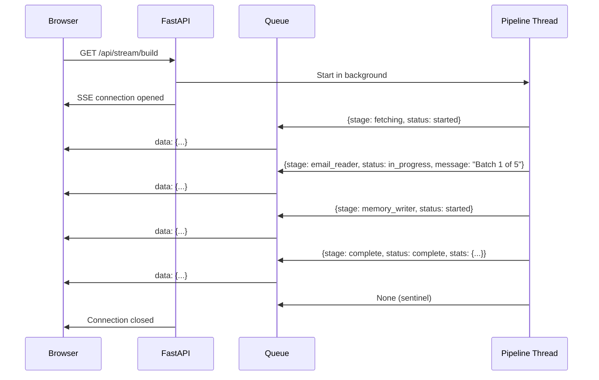

# Event Flow

## SSE (Server-Sent Events) — Build Pipeline

The build pipeline streams progress events from server to browser via SSE.



### Event Shape

```json
{
  "stage": "fetching | email_reader | memory_writer | complete | error",
  "status": "started | in_progress | complete | error",
  "message": "Human-readable progress text",
  "stats": {"total": 15, "decisions": 3, "people": 5, "commitments": 7}
}
```

### Retry Events

When Claude API returns 429/529, the retry callback emits:
```json
{
  "stage": "email_reader",
  "status": "in_progress",
  "message": "API overloaded - retrying in 4s (attempt 2/8)..."
}
```

## Frontend Event Consumers

Two UI elements consume SSE events simultaneously:

1. **Sidebar build indicator** (`#buildIndicator`) — compact dot + text + progress bar
2. **Home page build card** (`#homeBuildCard`) — full progress bar + stage list

Both are driven by the `updateProgress()` function inside `startIncrementalBuild()`.
