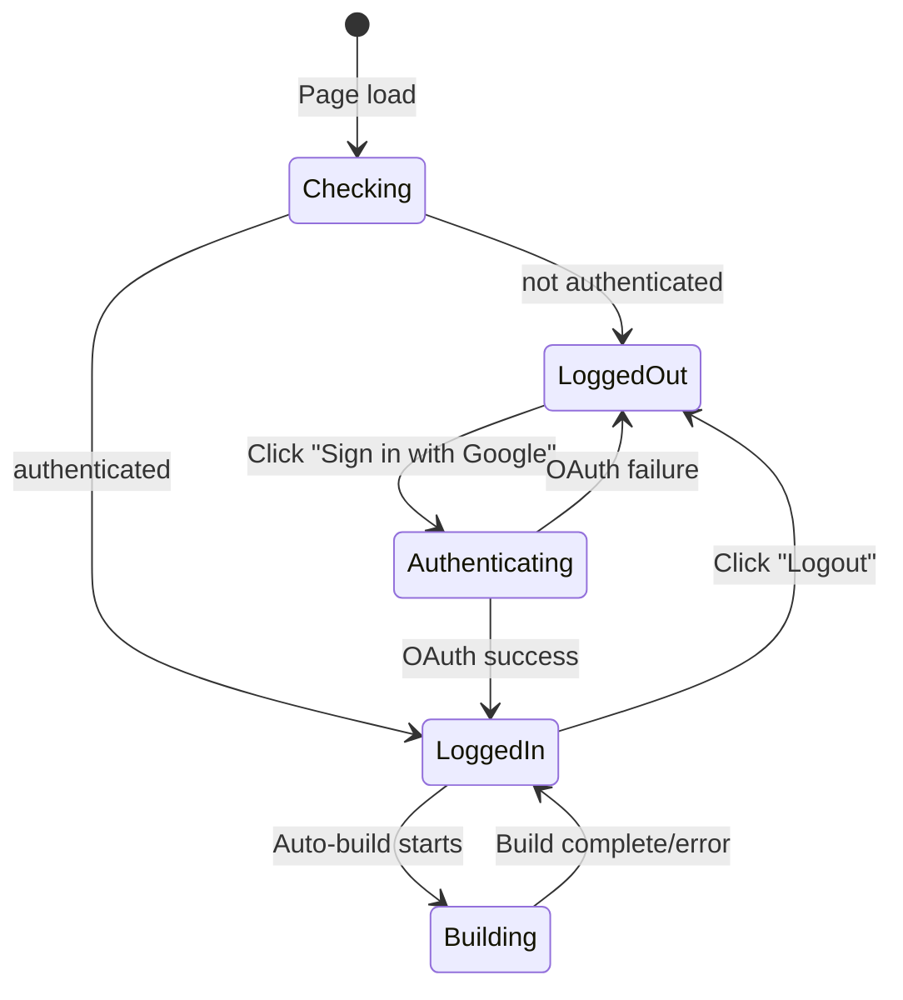
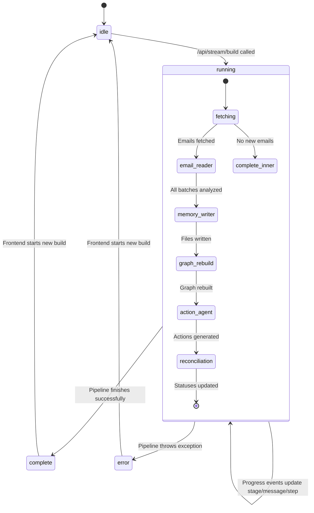
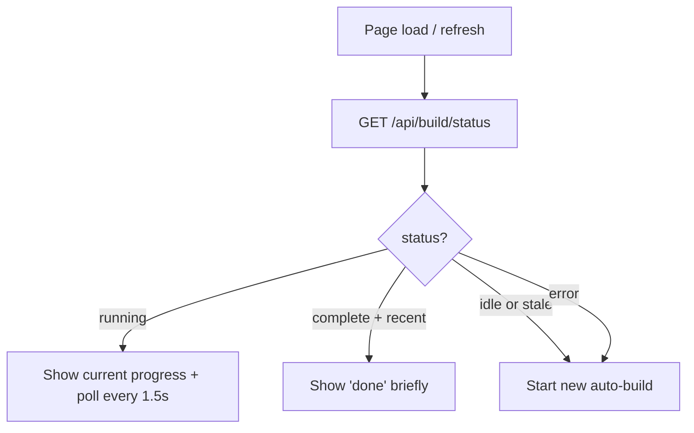
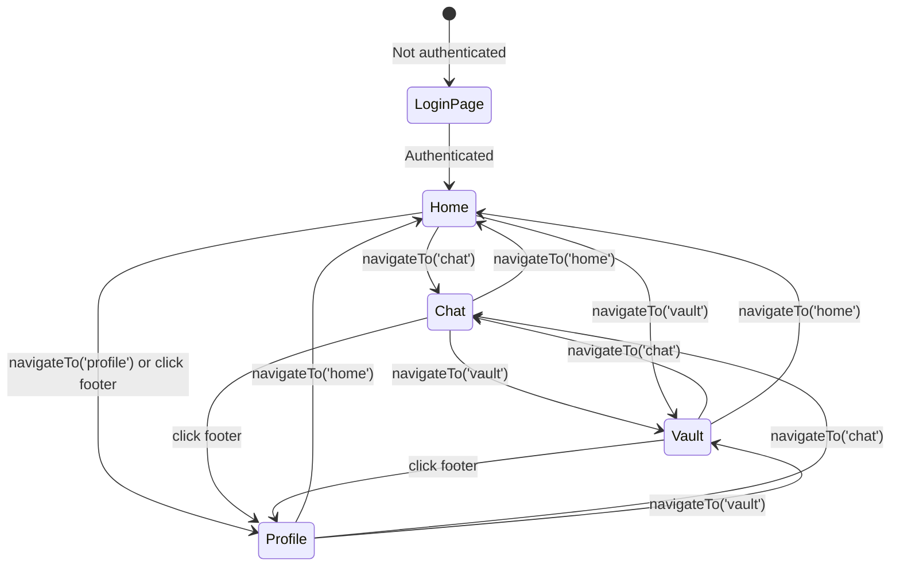
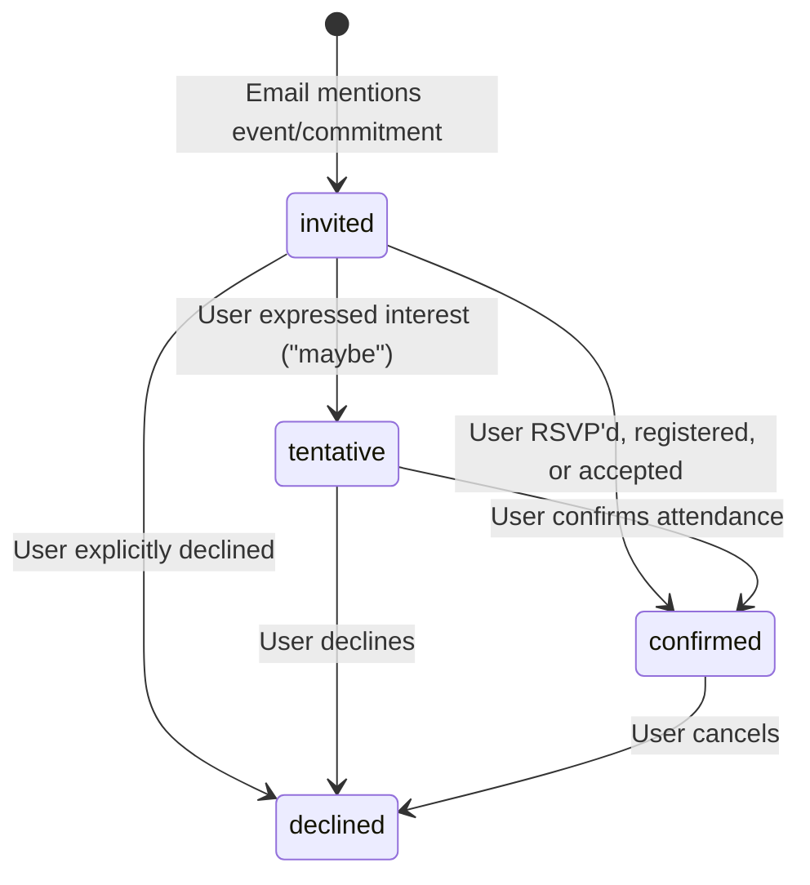

# State Machines

## Auth State

## Build Pipeline State (Backend-tracked)

The build state is persisted in-memory on the backend (`web/app.py:build_state`). The frontend polls `/api/build/status` on page load to reconnect to a running build instead of restarting it. Only one build can run at a time (409 returned if concurrent build attempted).

### Frontend Page-Refresh Behavior

## Frontend Page State

## Commitment Status Lifecycle

Tracks the user's participation state for commitment memory files.

- **Default**: `invited` — the LLM must have explicit evidence to set any other status
- **Evidence for confirmed**: words like "registered", "RSVP'd", "signed up", "accepted", "will attend"
- **Status is set at write time** by the Memory Writer Agent based on email content analysis

## Conversation State

| State | Trigger | Effect |
|-------|---------|--------|
| Welcome | Page load / new conversation | Show welcome message + suggestion chips |
| Composing | User types in input | Send button activates |
| Querying | User sends message | Input disabled, typing indicator shown |
| Received | API response arrives | Assistant message rendered, input re-enabled |
| Error | API call fails | Error message in chat, input re-enabled |
