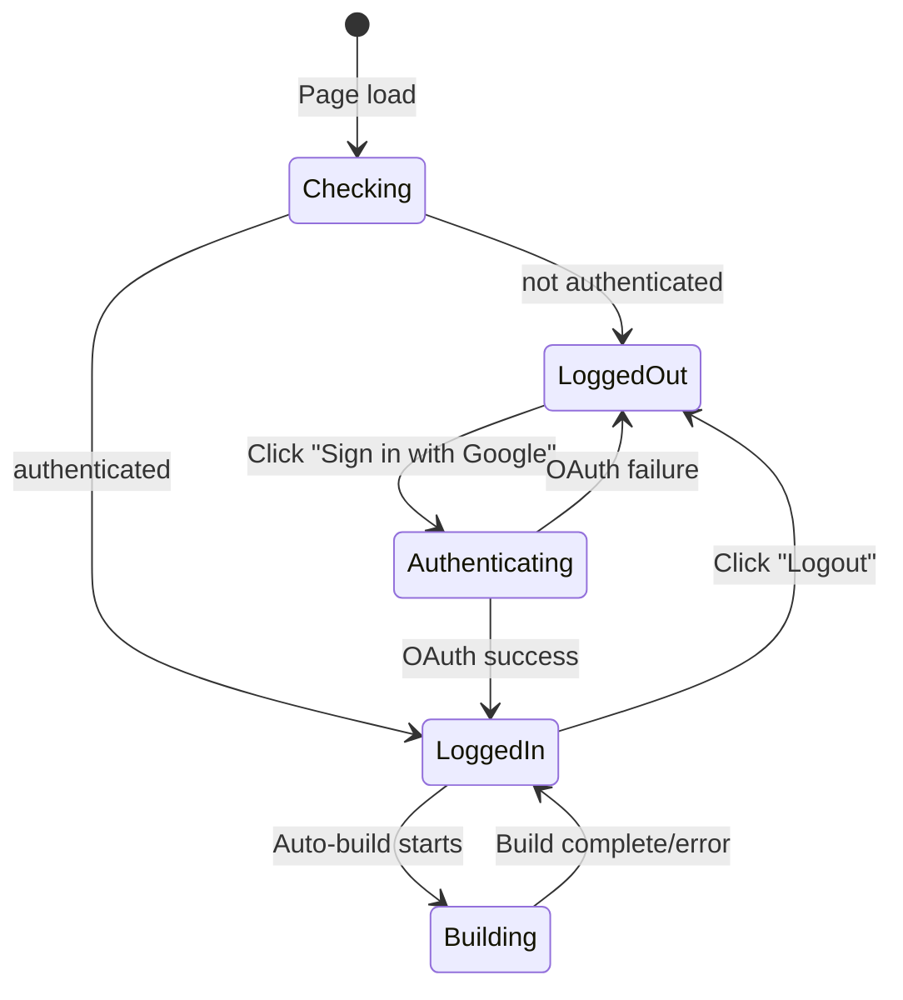
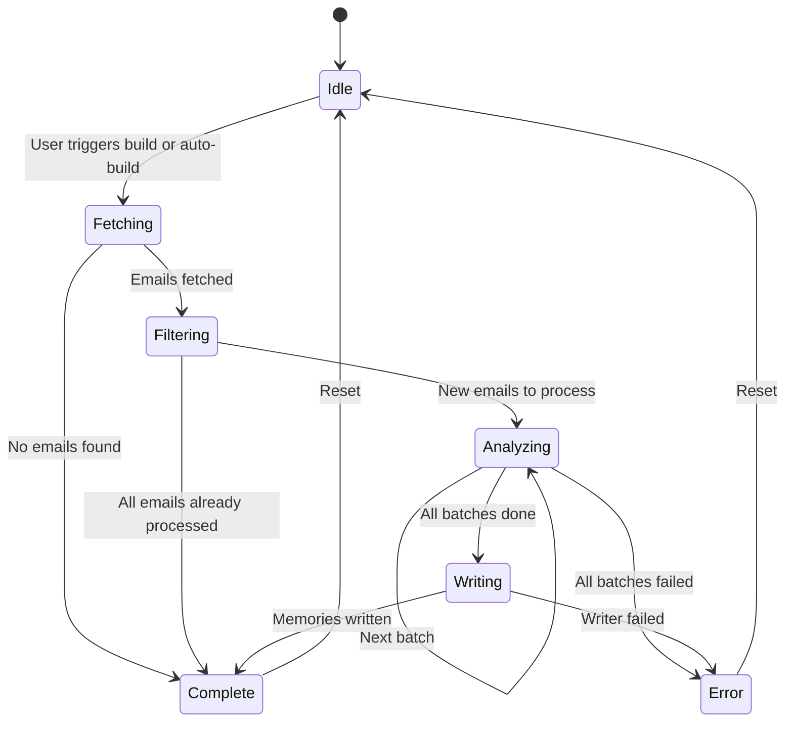
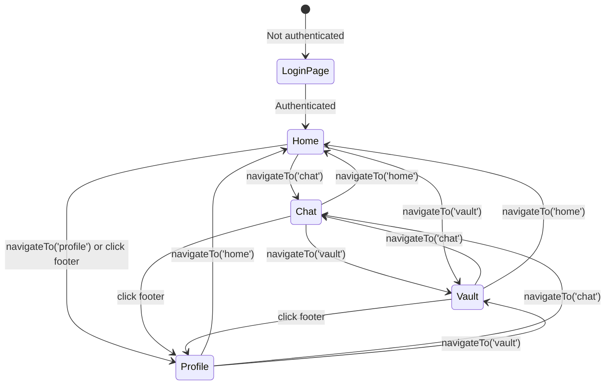

# State Machines

## Auth State

## Build Pipeline State

## Frontend Page State

## Conversation State

| State | Trigger | Effect |
|-------|---------|--------|
| Welcome | Page load / new conversation | Show welcome message + suggestion chips |
| Composing | User types in input | Send button activates |
| Querying | User sends message | Input disabled, typing indicator shown |
| Received | API response arrives | Assistant message rendered, input re-enabled |
| Error | API call fails | Error message in chat, input re-enabled |
